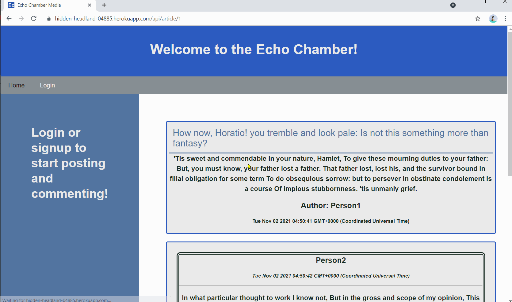

# Tech-Blog - The Echo Chamber
  -----------------

## Table of Contents
  - [Description](#Description)
  - [Installation Instructions and Getting Started](#Installation)
  - [Built With](#Built)
  - [Technologies Used](#Technologies)
  - [Authors](#Authors)
  - [Acknowledgments](#Acknowledgments)

## Description
This is a mock Tech Blog built with MySQL, Sequelize, Express.js, and Node.js. Discuss topics here without fear of disagreement because you will probably be the only one using it. (And because you are right!😉)

Features:
* Login, sign-up, or logout.
* Encrypted passwords.
* Session data tracked in cookies. 🍪
* Add, delete, and/or edit your posts.
* Comments on others' posts. (or your own!)
* Lurk around if you don't feel like signing up. 👻

**[Click this link to go to the Echo Chamber](https://hidden-headland-04885.herokuapp.com/)**

  

## Installation Instructions and Getting Started
Any modern internet browser will do! Just navigate to **[the webpage](https://hidden-headland-04885.herokuapp.com/)**.

## Built With

* [HTML](https://developer.mozilla.org/en-US/docs/Web/HTML)
* [CSS](https://developer.mozilla.org/en-US/docs/Web/CSS)
* [JavaScript](https://developer.mozilla.org/en-US/docs/Web/JavaScript)
* [Node.js](https://nodejs.org/en/)
* [Express.js](https://expressjs.com/)
* [MySQL2](https://www.npmjs.com/package/mysql2)
* [Sequelize](https://www.npmjs.com/package/sequelize)
* [Dotenv](https://www.npmjs.com/package/dotenv)
* [Handlebars](https://handlebarsjs.com/)
* [Brcypt](https://www.npmjs.com/package/bcrypt)

## Technologies Used
* [Microsoft Visual Studio Code](https://code.visualstudio.com/)
* [Git Bash](https://git-scm.com/downloads)
* [GitHub](https://github.com/)
* [Insomnia](https://insomnia.rest/)
* [Heroku](https://www.heroku.com/)

## Practices Used
* Agile style User Story and Acceptance Criteria.

## Authors
**Alexander Gibson** 

- [Link to Alex's Portfolio Site](https://argibson02.github.io/Professional-Portfolio-2/)
- [Link to Alex's Github](https://github.com/argibson02)
- [Link to Alex's LinkedIn](www.linkedin.com/in/alexander-gibson-1b0bb6105)

## Acknowledgments 😊
- Thanks to Jerome, Manuel, Cheng, and Daniel for instructing the UCB Coding Bootcamp.

